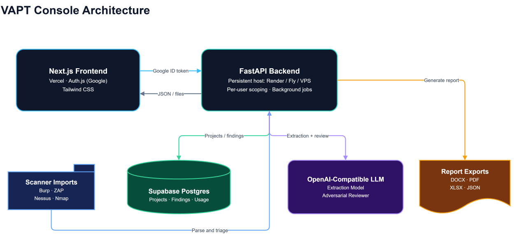

# VAPT Console

**An AI-assisted workspace for penetration testing — built on the premise that the AI should be assumed wrong until proven otherwise.**

VAPT Console takes a security engagement from raw evidence and scanner output, through triage, to a client-ready report. What makes it different is not that it uses an LLM: it is everything built to keep the LLM honest. Every AI-generated finding passes deterministic scoring, evidence grounding, an adversarial review pass, and prompt-injection handling before it is allowed anywhere near a report.

> For authorized security testing only. See [Security and privacy](#security-and-privacy).

---

## Why this exists

Automated scanners produce mountains of results, most of them false positives. LLMs will happily invent plausible-sounding vulnerabilities. Neither is trustworthy on its own.

This tool treats the model as a fast, tireless junior analyst whose every claim is checked:

| Guardrail | What it does |
| --- | --- |
| **Deterministic CVSS v3.1** | Base scores are computed from the vector in code. The model does not get to do the math. |
| **Evidence grounding** | Each finding's "proof" is checked against the source material and labelled VERIFIED / PARTIAL / UNVERIFIED to catch fabrication. |
| **Adversarial review pass** | A second, reasoning-grade model argues the skeptical case — could this be a false positive? what benign explanation fits the same evidence? — and returns a verdict. |
| **Prompt-injection handling** | Scanner output and target responses are untrusted input. They are fenced, and the model is instructed to treat them as data, not instructions. |
| **Severity cross-check** | Model-assigned severity is compared against the computed CVSS band, and disagreements are flagged rather than silently resolved. |

Findings that fail any of these checks are surfaced with a verification flag instead of being quietly dressed up as facts.

---

## Screenshots

> Add screenshots or a short screen recording here — the sign-in landing, the Overview dashboard, and the Import triage flow are the three that tell the story fastest.

---

## Features

**Analysis**
- Extract structured findings from raw evidence: HTTP requests and responses, scanner output, logs, configuration, source code
- Eight analysis modes (OWASP Top 10, API security, security headers, information disclosure, access control, report generation, false-positive check, remediation advice)
- Attach text evidence files (TXT, LOG, JSON, HAR, CSV, XML, YAML, MD) alongside pasted input
- Edit any extracted finding before it is committed to a project

**Scanner import and AI triage**
- Import Burp Suite (XML), OWASP ZAP (JSON/XML), Nessus (.nessus), Nmap (XML), and generic CSV
- Severity normalization, asset-aware deduplication, and a deterministic noise filter, all offline
- Optional AI triage: the adversarial reviewer flags likely false positives *before* you commit them, with deterministic pre-filters so no LLM calls are spent on informational noise

**Risk and frameworks**
- Risk prioritization blending CVSS with EPSS exploit probability and the CISA KEV catalog — priority reflects real-world exploitability, not just a severity label
- Automatic indicative mapping to OWASP Top 10:2025, PCI DSS 4.0, CWE, and MITRE ATT&CK
- Findings with no reliable signal stay explicitly unmapped rather than being guessed at

**Workflow and reporting**
- Multi-project workspace with per-user isolation
- Filterable findings list with expandable detail, inline editing, and retest recording (outcome, retester, date, evidence, notes) across rounds
- One-click export to DOCX, PDF, XLSX, and JSON, enriched with risk, framework, and retest data
- Aggregate dashboard across all projects: severity/status/category breakdowns, risk priorities, OWASP coverage, verification flags, and token usage

**Model configuration**
- Two independently configurable model lanes: a fast **extraction** model and a reasoning **reviewer** model
- Bring your own API key for any OpenAI-compatible provider (Groq, OpenRouter, OpenAI, Together, Mistral, and more)
- Model lists are fetched live from the provider, with a per-lane connection test so misconfiguration surfaces in a second rather than three minutes into a job
- User-supplied provider URLs are allowlisted and SSRF-checked
- A shared server key can be offered for demo use with a per-user rolling quota, so one visitor cannot drain a free provider tier; runs on a user's own key are unmetered

---

## Architecture


---

The backend runs as a **persistent server**, not serverless: analysis and triage make multiple reasoning-model calls and run for minutes in background threads, which serverless platforms terminate. The frontend is static-friendly and deploys anywhere.

**Multi-tenancy:** every project and finding is owned by a Google `sub`, and every query is scoped to the authenticated user. Finding operations are authorized through the parent project, so no account can read or write another's data.

---

## Tech stack

| Layer | Choice |
| --- | --- |
| Frontend | Next.js 14 (App Router), React 18, TypeScript, Tailwind CSS |
| Auth | Auth.js v5 with Google OIDC; ID tokens forwarded to the API and verified server-side |
| Backend | FastAPI, Python 3.11, background worker threads |
| Database | Supabase Postgres via psycopg3 with connection pooling |
| LLM | Any OpenAI-compatible provider, two independently configured lanes |
| Reports | python-docx, ReportLab, openpyxl |
| Enrichment | FIRST.org EPSS, CISA KEV, NVD (standard library only) |

No graphics dependencies: the landing page's animated background is a hand-written WebGL fragment shader and a canvas particle field, with graceful degradation.

---

## Getting started

Requires Python 3.11+, Node 18+, a Supabase project, a Google OAuth client, and an API key for any OpenAI-compatible LLM provider.

### Backend

```bash
cd backend
pip install -r requirements.txt

export DATABASE_URL="postgresql://...:6543/postgres"   # Supabase transaction pooler
export GOOGLE_CLIENT_ID="...apps.googleusercontent.com"
export VAPT_MAIN_API_KEY="your-provider-key"
export FRONTEND_ORIGINS="http://localhost:3000"
export VAPT_AUTH_DISABLED=true                          # dev only: explore /docs without a token

uvicorn main:app --reload --port 8000
```

Run `backend/schema.sql` once in the Supabase SQL editor. Interactive API docs are at `http://localhost:8000/docs`.

### Frontend

```bash
cd frontend
npm install
cp .env.local.example .env.local     # fill in the values below
npm run dev                          # http://localhost:3000
```

For local Google sign-in, add `http://localhost:3000` as an authorized JavaScript origin and `http://localhost:3000/api/auth/callback/google` as a redirect URI on your OAuth client.

### Try it with the sample data

The `samples/` directory contains synthetic scanner reports and evidence, so you
can exercise the whole flow without pointing the tool at anything real:

```
samples/burp-suite-report.xml    Burp Suite XML  -> 5 candidates
samples/zap-report.json          OWASP ZAP JSON  -> 5 alerts
samples/nessus-scan.nessus       Nessus          -> 5 items (1 Critical)
samples/nmap-scan.xml            Nmap XML        -> 4 open ports
samples/generic-findings.csv     CSV             -> 6 findings
samples/analyzer-evidence.txt    HTTP evidence for the Analyzer
```

Upload a scanner file under **Import** and run AI triage: the set deliberately
mixes findings with real evidence behind them against findings that only pattern
matched, so you can see the reviewer separate the two. See
[samples/README.md](samples/README.md) for what each file demonstrates.

All hosts are RFC 2606 reserved `.test` domains and all addresses come from the
RFC 5737 documentation ranges.

### Deployment

See **[DEPLOY.md](DEPLOY.md)** for a complete zero-to-production walkthrough: Google OAuth, Supabase, the LLM provider, backend on Render, frontend on Vercel, and the cross-references between them.

---

## Configuration

### Backend

| Variable | Purpose | Default |
| --- | --- | --- |
| `DATABASE_URL` | Supabase Postgres connection string (use the transaction pooler, port 6543) | required |
| `GOOGLE_CLIENT_ID` | OAuth client ID; the audience every ID token is verified against | required |
| `FRONTEND_ORIGINS` | Comma-separated allowed CORS origins | `http://localhost:3000` |
| `VAPT_MAIN_API_KEY` | LLM key; drives both lanes unless a lane sets its own | required |
| `VAPT_MAIN_BASE_URL` / `VAPT_MAIN_MODELS` | Extraction lane endpoint and model chain | Groq / `llama-3.3-70b-versatile` |
| `VAPT_REVIEW_BASE_URL` / `VAPT_REVIEW_API_KEY` / `VAPT_REVIEW_MODELS` | Reviewer lane overrides | inherits main / `openai/gpt-oss-120b` |
| `VAPT_REVIEW_MAX_FINDINGS` | Cap on findings reviewed per analysis | `12` |
| `VAPT_REVIEW_INPUT_CHARS` | Characters of the original input given to the reviewer per finding (`0` sends all of it) | `4000` |
| `VAPT_TRIAGE_MAX_FINDINGS` | Cap on candidates triaged per import | `20` |
| `VAPT_ALLOWED_LLM_HOSTS` | Extra provider hosts users may configure | built-in allowlist |
| `VAPT_DEMO_RUN_LIMIT` | Analyses/triages per user per window on the shared key (`0` disables the cap) | `5` |
| `VAPT_DEMO_WINDOW_HOURS` | Rolling window for the demo quota | `24` |
| `VAPT_HTTP_TIMEOUT` | LLM request timeout, seconds | `60` |
| `VAPT_AUTH_DISABLED` | Development only: bypass Google auth | off |

Model chains are comma-separated and tried in order, so a rate-limited or unavailable model falls through to the next.

### Frontend

| Variable | Purpose |
| --- | --- |
| `NEXT_PUBLIC_API_URL` | Backend base URL |
| `AUTH_SECRET` | Auth.js secret (`openssl rand -base64 32`) |
| `AUTH_GOOGLE_ID` / `AUTH_GOOGLE_SECRET` | Google OAuth client credentials |
| `AUTH_URL` | Canonical app URL (production) |

---

## Running on free provider tiers

The reviewer lane is the expensive one, and it is **token**-bound rather than
request-bound: it is called once per finding, so a large evidence file would
otherwise be re-sent for every finding under review. Two things keep that
affordable.

**Split the lanes across providers.** Extraction and review each take their own
base URL and key, and each provider meters its own quota, so pointing the two
lanes at different providers roughly multiplies the available headroom. Pairing a
fast model for extraction with a stronger reasoning model on a second provider
for review also improves the review pass, which is the one that most affects
output quality.

**Send the reviewer only what it needs.** Each review receives the slice of the
original input that bears on that finding rather than the whole file, located by
the finding's own evidence, URL, and parameter. On a 50k-character input this cuts
the reviewer lane by roughly 9x. Inputs already within `VAPT_REVIEW_INPUT_CHARS`
are passed through untouched, and when an excerpt is used the reviewer is told so
explicitly, so trimmed context is never mistaken for missing evidence.

Free tiers are generally funded by training on submitted prompts. That is the
practical reason to use a paid or private endpoint for anything that is not
synthetic: findings and their evidence are exactly the material that should not
enter someone else's training corpus.

## API

All endpoints require a Google ID token as `Authorization: Bearer <token>` and are scoped to that user.

| Method | Path | Purpose |
| --- | --- | --- |
| `GET` | `/health` | Liveness |
| `GET` | `/me` | Current user |
| `GET` | `/overview` | Aggregate dashboard across all projects |
| `GET` | `/usage` | LLM usage summary |
| `GET` `POST` | `/projects` | List / create projects |
| `GET` `DELETE` | `/projects/{id}` | Get / delete a project |
| `GET` `POST` | `/projects/{id}/findings` | List (with risk and framework mapping) / create |
| `POST` | `/projects/{id}/findings/commit` | Bulk-commit scanner candidates with asset-aware dedup |
| `PATCH` `DELETE` | `/findings/{id}` | Update / delete a finding |
| `POST` | `/findings/{id}/retest` | Record a retest outcome |
| `POST` | `/analyze` | Start an analysis job |
| `POST` | `/scan/parse` | Upload scanner files, get normalized candidates |
| `POST` | `/scan/triage` | Start an AI triage job |
| `GET` | `/jobs/{id}` | Poll a background job |
| `POST` | `/projects/{id}/report` | Export DOCX / PDF / XLSX / JSON |
| `GET` | `/demo/quota` | Remaining shared-key runs for this user |
| `GET` | `/llm/providers` | Allowlisted provider hosts |
| `POST` | `/llm/models` `/llm/test` | List a provider's models / test a lane |

Long-running work returns a `job_id` and is polled via `/jobs/{id}`. Jobs run in background threads and survive page navigation; the UI reconnects to a running job when you return.

---

## Security and privacy

**Authorized use only.** This is a defensive assessment aid. Use it only against systems you have explicit written permission to test.

**Built-in protections**
- Per-user data isolation enforced in every query, with finding access authorized through the parent project
- Google ID tokens verified against Google's public keys with a mandatory audience check
- All SQL parameterized
- User-supplied LLM provider URLs restricted to an allowlist and rejected if they resolve to loopback, private, link-local, or reserved addresses (SSRF protection)
- Per-request model configuration held thread-locally, so one user's provider and key can never leak into another's job
- Scanner XML parsed without external entity resolution
- Scanner and target content treated as untrusted throughout the LLM pipeline

**Data handling.** Findings and their evidence are sent to whichever LLM provider you configure. Free provider tiers may retain or train on inputs. **Do not push real client or confidential engagement data through a free tier** — use a paid or private endpoint, and prefer redaction. Bring-your-own API keys are stored in your browser and sent per request; they are never written to the database.

**Known limitations.** Background jobs are held in memory and do not survive a server restart; the UI reconnects to a running job across navigation, but a job in flight during a redeploy is lost.

---

## Testing

```bash
cd backend
pip install -r requirements.txt -r requirements-dev.txt
pytest
```

131 offline unit tests covering the SSRF guard on user-supplied provider URLs,
every scanner parser, risk and framework mapping, verification-signal parsing,
and the thread isolation that keeps one user's API key out of another user's
concurrent job. No network, database, or LLM calls: the suite runs in about a
second. See [backend/tests/README.md](backend/tests/README.md) for what each file
protects and which regressions are pinned.

## Project structure

```
backend/
  main.py            FastAPI app: routes, background jobs, per-user scoping
  auth.py            Google ID token verification
  pg_store.py        Multi-tenant Postgres data layer
  llm_config.py      Provider allowlist and SSRF validation
  gemini_client.py   Two-lane LLM client: extraction, deterministic CVSS,
                     evidence grounding, skeptical review, triage
  scan_import.py     Scanner parsers to normalized finding candidates
  risk_map.py        Risk prioritization and framework mapping
  cve_enrich.py      EPSS / CISA KEV / NVD enrichment
  qa_utils.py        Verification-signal parsing
  exporter.py        DOCX / PDF / XLSX / JSON reports
  schema.sql         Postgres schema
  tests/             Offline unit tests (pytest)

samples/             Synthetic scanner reports and analyzer evidence

frontend/
  src/app/           App Router pages: overview, projects, analyzer, import,
                     findings, reports, settings
  src/components/    Shell, nav, modals, finding editor, retest, toasts, visuals
  src/lib/           API client, types, preferences, project context
  src/hooks/         Background-job polling
```

---

## Roadmap

- Privacy-preserving redaction: mask secrets, tokens, and PII before anything leaves for the LLM
- Per-user rate limiting on analysis and triage
- Postgres-backed job store so long jobs survive a restart
- Grounded automatic executive summary
- Per-finding confidence score folding all verification signals into one number
- HAR-to-analyzer summarizer
- CVSS v4.0

---

## Disclaimer

Provided for educational and authorized professional use only. The authors accept no liability for misuse. AI-generated output is decision support and must be validated by a qualified professional before it informs any report, remediation, or business decision.

## License

MIT. See [LICENSE](LICENSE).
